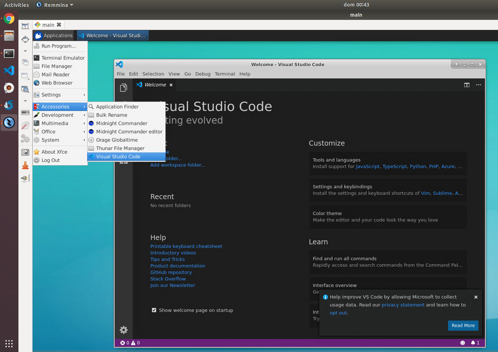

# docker-vscode

docker-ubuntu + docker-dotnet + docker-rdp + desktop development environment ( vscode )

## build image

```
./build.sh
```

## run image

```
docker run -tid \
	--name=vscode \
	-e DEVEL0PWD=somepass \
	-p 10.10.10.10:3389:3389 \
	searchathing/vscode:server-mgr
```

## install rdp client

```
apt install freerdp2-x11
```

## test rdp connection

```
xfreerdp /v:10.10.10.10 /u:devel0 /p:somepass
```

## start vscode

```
vscode
```


